# 注意! 本框架是个人开发, 用于商业开发前建议先做一下评估.

## 基于cocos creator的UI框架, 使用过程中有任何问题,可以加QQ群: 552424835

### 当前使用的cocos creator版本2.4.8版本. 理论上支持2.2.x ~ 2.4.x的所有版本.  3d版本目前在开发中... 尽请期待

// todo list
+ 简单的2d物理系统 仅支持矩形, 方便做同步.
+ AdapterMgr优化, 支持可视化设置.
+ 添加浮窗层, 浮窗层和弹窗层级独立.
+ Toast条.
+ ~~自动生成UIConfig.ts.~~ 已完成
+ ~~LRU销毁不常用的窗体.~~ 已完成
+ ~~模态层支持模糊效果.~~ 已完成


## 0, 简单介绍

基于Cocos Creator的UI框架, 采用单场景+多预制体模式. 界面中的窗体都按需加载, 复用性高. 使用者只需要关心界面内的逻辑, 其他的
场景切换, 弹窗管理, 资源管理都可以交给框架.

对于游戏中的窗体, 可以大致分为4类.

+ Screen
+ Fixed
+ Window
+ Tips

以下图为例

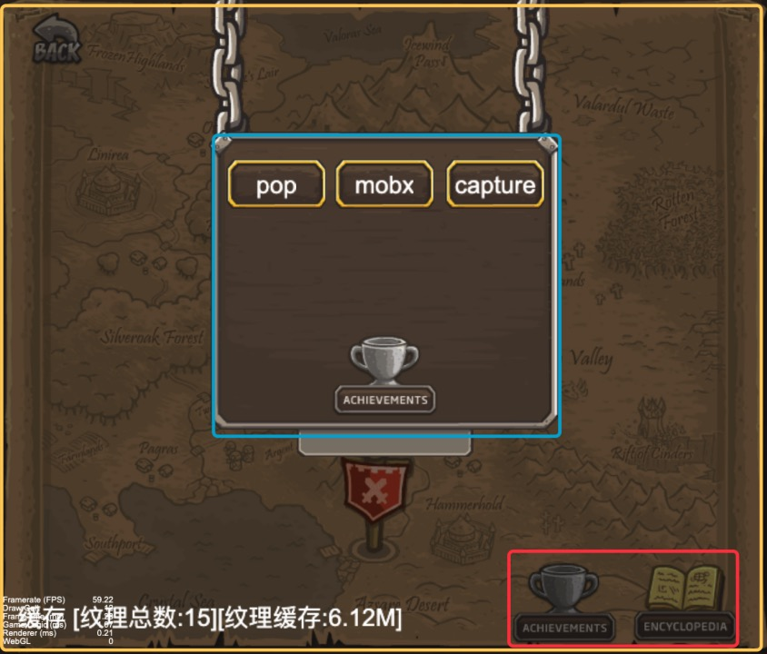

**Screen**可以理解为场景, 一般是会铺满屏幕. 如上图黄色框中的地图. </br>
**Fixed**则是一下固定在场景屏幕边缘的功能性UI, 如上图红色框中的两个按钮.</br>
**Window**则是游戏中的各种弹出窗体, 一般会有一个弹出动画. 如上图蓝色框中的面板.</br>
**Tips**则是一些提示性窗体, 比如断线提示窗体. 这种窗体的特点是不受其他窗体的影响, 只管自己显示和隐藏.</br>

tips: **Screen**窗体切换时会隐藏当前显示的**Fixed**, **Window**窗体, 以到达切换场景的效果.

## 1. 项目结构

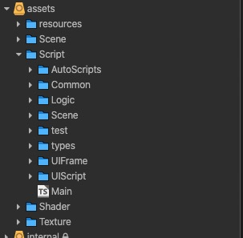

- AutoScripts: 是插件AutoBinder生成的代码. (待实现: 自动清理未被使用的文件)
- Common: 一些公共的脚本文件, 有工具类, 和一些封装好的组件.
- Logic: 用户自定义的管理类, 如ConfigMgr
- types: 提供wx小游戏的api提示
- UIFrame: 框架核心脚本
- UIScript: 用户自定义的界面控制脚本
- Main.ts: 类似入口脚本

## 2. 启动流程
打开Main场景, 在结点树上可以看到有一个Scene结点

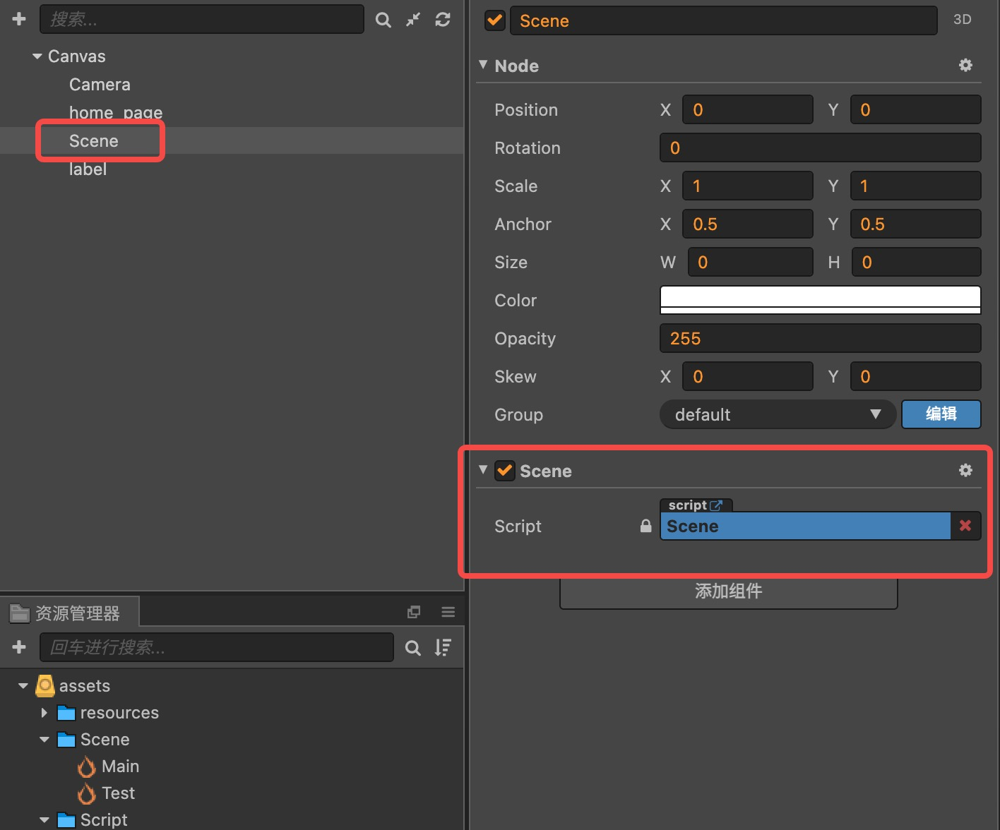<br>
Scene结点很关键, 它作为框架的UI层级的父节点, 所以如果你有其他独立与UI框架的层级的需求时,可以根据Scene结点的层级做调整.

Scene结点上挂载了Scene脚本, 打开这个脚本可以看到onGameInit方法, 这个方法控制游戏的初始化流程.  流程如下
```typescript
// 第一步 展示loading页面，当然有些默认就是loading页面, 可以把loading界面做在场景中, 遮挡住Scene结点.

// 第二步 初始化游戏（Managers，Configs，SDKs）
await Game.init(this.node);
// 第三步 构建初始场景（加载必要的prefab，音频，texture）
await ResMgr.loadRes() 或者 await UIManager.getInstance().loadForm() 等等
// 第四步 加载主界面UI,关掉loading页面,正式进入游戏
await SceneMgr.open("");
this.loading.destory();// 假设你已经获取到了loading ui
```

Game.ts脚本则是作为游戏的逻辑层控制器. 打开可以开到init方法, 这个方法控制游戏内控制器的初始化.
```typescript
// 初始化Manager, 例如new ConfigMgr();
this.configMgr = new ConfigMgr();
this.playerMgr = new PlayerMgr();
// 初始化平台sdk

// 加载配置信息, 因为在这里就已经加装完毕配置信息了, 所以后面加装主界面UI时, 就可以读取相关配置了
await this.configMgr.loadConfigs();
```

Game.ts脚本还可以控制逻辑控制器的时间更新, 打开update方法.

```typescript
if(!this.inited) return ;
Task.update(dt); // 更新任务进度
```

## 3. 框架结构

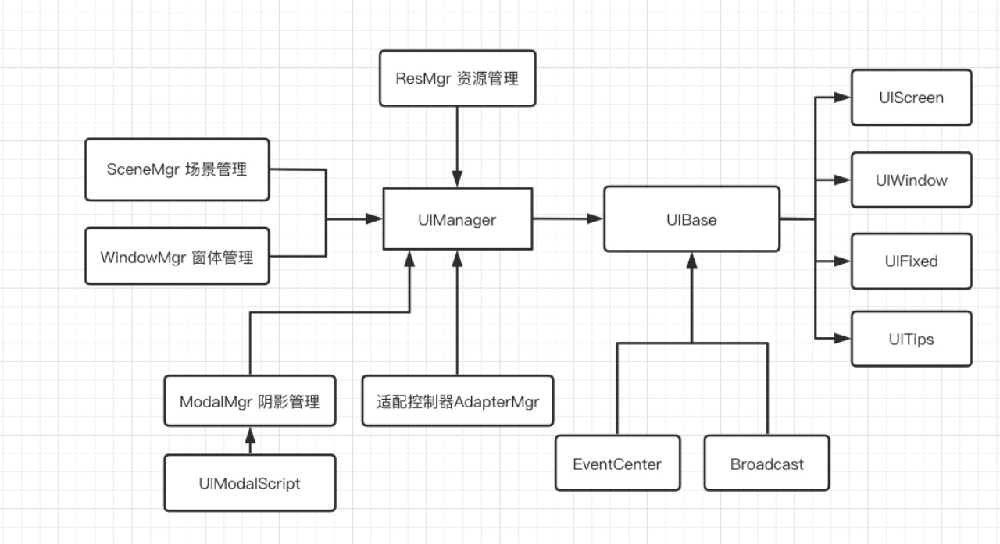

采用UIBase + UIManager两个核心类管理整个框架, 其他的Manager辅助UIManager进行管理.

### UIBase篇

UIBase中定义窗体的属性和一系列的生命周期方法</br>
```typescript
formType: FormType;           // 窗体类型
modalType: ModalType;         // 模糊层类型
closeType: ECloseType;        // 关闭类型, CloseAndDestroy, CloseAndHide, LRU(使用LRU cache控制窗体销毁时机)
```

实际项目中不要直接继承UIBase, 请继承它的子类 UIScreen, UIFixed, UIWindow, UITips. 子类中预实现了一些功能.</br>

生命周期方法</br>
```typescript
async load(): string;                         // 只调用一次, 异步方法, 返回一个错误信息.
onInit(): void;                               // 只调用一次, 初始化.
onShow(): void;                               // 每次显示时调用.
onload(): void;                               // cocos提供
start(): void;                                // cocos提供
onAfterShow(): void;                          // 显示动画结束后调用
onHide(): void;                               // 隐藏时调用
onAfterHide(): void;                          // 隐藏动画结束后调用
onDestory(): void;                            // cocos提供
```

显示和隐藏动画, 使用者可以重写下面两个方法, 实现自定义的显示隐藏动画.</br>
```typescript
async showEffect(): void;                      // 窗体显示动画
async hideEffect(): void;                      // 窗体隐藏动画
```

### UIManager篇

UIManager在getInstance()时, 会自动的创建UIROOT和四个子节点. 结构如下图</br>
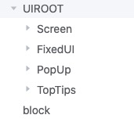</br>
这四个子节点对应的UIBase中的四种类型, 对应类型的窗体会被挂载到对应结点下.

UIManager只暴露的四个接口.

```typescript
loadForm(path: string): UIBase;                                       // 预加载窗体
openForm(path: string, param: any, formData: IFormData): UIBase;      // 打开窗体
closeForm(path: string): UIBase;                                      // 隐藏窗体
getForm(path: string): UIBase;                                        // 获得窗体
```

UIManager在打开窗体时, 会获取窗体上的UIBase组件, 然后根据类型, 将窗体挂载到不同的node上. 然后触发UIBase中的
生命周期方法.

UIManager内部控制流程如下图.. </br>
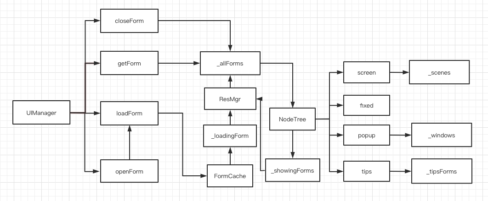

loadForm和openForm复用同一个加装回调, 所以不用担心预加载窗体后, 还没等预加载结束就调用openForm导致的加装浪费.

### 其他Manager

#### WindowMgr 窗体控制器
UIManager中其实已经通过栈结构实现了简单的窗体控制, 但是对于一些复杂的控制效果, 则交给WindowMgr实现.
比如优先栈和等待栈, 优先栈指的 每一个窗体有一个优先级, 根据优先级的不同在优先栈会有不同的排序效果, 从而影响窗体弹出顺序.
等待栈指的

```typescript
WindowMgr.open(prefabPath: string, params?: any, formData: IFormData = {showWait: false, priority: EPriority.FIVE});														 // 打开, formData中 showWait表示是否进入等待队列, priority表示优先级.
WindowMgr.close(prefabPath: string);					// 关闭
```

#### SceneMgr 场景控制器
```typescript
// 打开场景
SceneMgr.open(scenePath: string, params?: any, formData?: IFormData);
// 退回上一个场景
SceneMgr.back(params?: any, formData?: IFormData);
```

#### ResMgr 资源控制器

ResMgr管理窗体的资源, 恪守  **我释放的是我加载的资源, 我加载的资源会被释放**. </br>

不建议用户直接使用这个Manager. 里面主要是加载窗体,和动态资源.

```typescript
ResMgr.inst.loadDynamicRes(url: string, type: typeof cc.Asset, tag: string);		// 加载动态资源, 内部使用
// 上面的方法请通过这个方法调用 UIBase.loadRes(url: string, type?: typeof cc.Asset);														
```

#### AdapterMgr 适配控制器
对窗体进行位置适配, 比如对于screen类型的窗体, 框架默认为它添加了全屏的适配, 如下
```typescript
AdapterMgr.inst.adapteByType(AdapterType.StretchHeight | AdapterType.StretchWidth, this.node);
```

todo... 做成可视化组件

## 4 .插件和demo, 都是我日常开发中觉得可以提高开发效率的一些产品和尝试

### 自动生成UIConfig插件 AutoConfig </br>
快捷键 alt + f

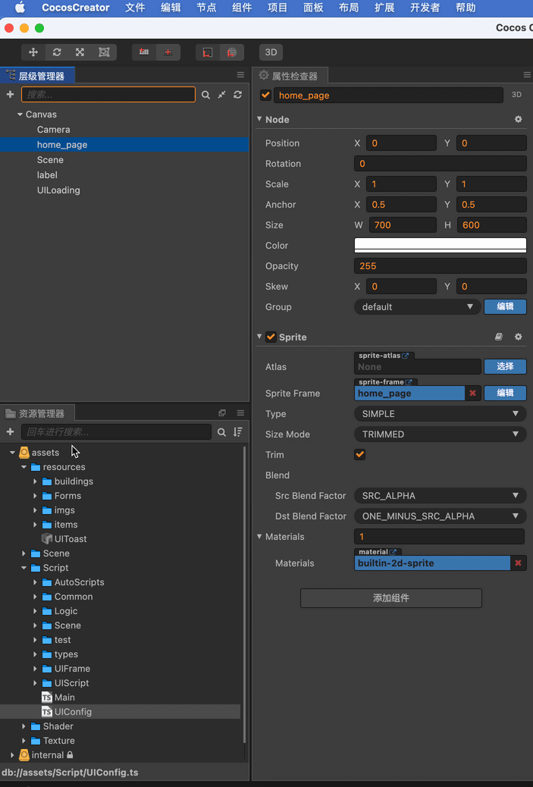</br>

UIConfig文件里除存储的是UI名称和UI路径的关系, 现在可以自动生成UIConfig文件了.

### 自动绑定结点插件 AutoBinder </br>
快捷键 alt + g
根据规范的命名规则实现代码自动生成和结点绑定 </br>
如: _Label$Name </br>
_ 下划线表示这个结点是需要被绑定的 </br>
Label 表示属性的类型, 支持自定义组件, 命名映射可以修改 </br>
$ 分隔符 </br>
Name 属性名称 </br>

通过Alt + g就会自动生成 </br>
@property(cc.Label) Name: cc.Label = null;的代码 </br>
然后将脚本挂载在根节点上, 在将_Label$Name结点绑定在组件上 </br>

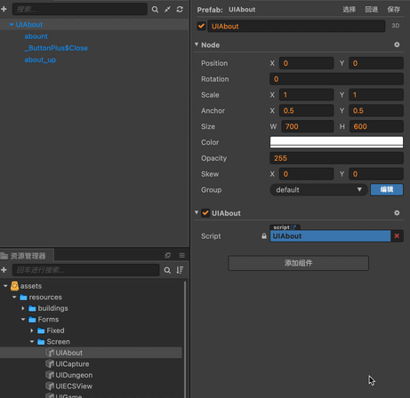


### 状态控制器 PropController
类似fgui中的状态控制器, 已经在实际项目中使用过, 状态控制只需一行代码. 支持自定义脚本的自定义属性.
视频介绍: https://www.bilibili.com/video/BV1ig411u7vK#reply4845159639

## 更新了2dlight, 实现了取反的阴影效果
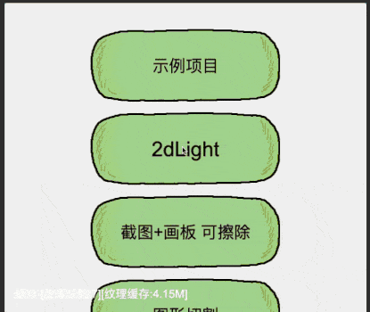


## 更新了画板, 可以在图片上绘制图案, 擦除颜色等


## 2021/01/31 Binder plus, 升级了项目中的自动结点绑定
注意: 目前第一次生成脚本时无法立即绑定到对应结点上, 需要再次执行一次run 即可.

支持代码生成和结点绑定

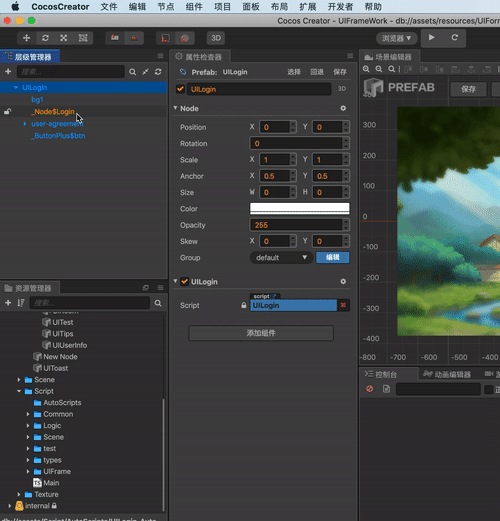

## 2020/10/19 Mask Plus, 支持自定义遮罩
扩展了cc.Mask, 添加了一种枚举类型Polygon
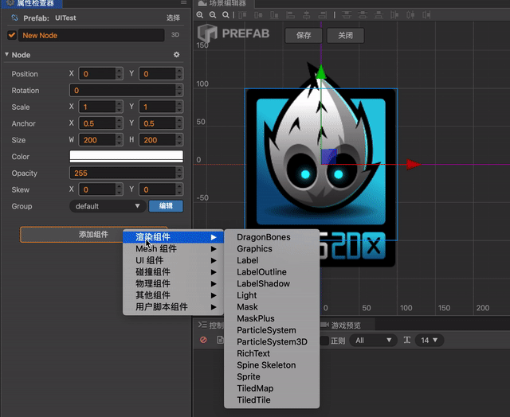

## 2020/10/15 添加2d光线功能
2d光影效果, 项目在2dlight分支, 目前还在优化中 关键代码在Script/Common/light下, 有兴趣的可以看看
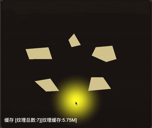

## 2020/7/28 集成ECharts
集成了ECharts, 在ECharts-Support分支, 有需要的可以看看

## 2020/7/10 新增功能
集成Mobx，对于Mobx的使用详情可以前往Mobx的官网了解，github地址 https://github.com/mobxjs/mobx
对于cocos使用例子可以看项目中UIHall的实现

注意事项：将mobx导入为插件时需要将允许编辑器加载打上勾✅

## 2020/5/10 项目结构修改
UIManager -> UIBase             UIManager控制UIBase的加载，释放，显示，隐藏
UIMaskManager -> UIMaskScript   UIMaskManager控制UIMaskScript的显示，隐藏

UIBase继承UIBinder，默认自动绑定UI节点，添加onShow, onHide，showAnimation, hideAnimation的接口
生命周期 load -> onShow -> onLoad -> start -> onHide -> onDestory

EventCenter替换GEventManager，EventCenter使用双层Map，优化了emit的速度

去掉了一些冗余属性和方法，优化了属性，方法名称，精简才是王道


## 2019/10/16 新增功能

1, 将BaseUIBinder分离出来作为BaseUIView的父类, 如果希望使用BaseUIBinder的功能, 请为你的结点添加BaseUIView组件, 你也可以自己继承BaseUIBinder, 然后调用_preInit方法

为什么这么做?
        对于UIForm的控制我尝试过多种方法, 这一次是希望实现一个类似MVC的控制结构, 对于一个UIForm, 我们为其添加C(控制)和V(视图)组件
例如, 我在LoginForm预制体添加的组件一样, 将Form的动画, 显示放在View脚本中, 而事件的监听, 游戏逻辑则放在Control脚本中, 当然View脚本不是必须的
你也可以只实现Control脚本

2, 场景切换(在本单场景管理, 即是Normal结点的更换), 添加加载过度动画

如何使用: 
        1, 在游戏的Main脚本中设置UIIndependentManager.getInstance().setLoadingForm("UIForm/LoadingForm"); 过度场景
        2, 在加载场景时使用UIManager.GetInstance().ShowUIFormWithLoading("UIForm/HallForm");
如上, 在HallForm中需要提前加载的UIform或者其他资源, 可以放在HallForm的load方法中, 这样就会在load内资源加载完毕, 在关闭LoadingForm, 完美实现场景切换

3, 新增了Independent结点与类型
        Independent类似常驻结点, 是独立于其他窗体的特殊窗体, 不会受到其他窗体的影响, 例如加载过度窗体, 就属于独立窗体, 不会因为其他窗体设置了HideOther属性就将其隐藏

## 2019年9月26日新增功能

扩展button, 为button组件添加了

1. 点击button播放音效
2. 屏蔽连续点击

需要注意的是, ButtonPlus.ts需要配合插件使用, 插件路径位于UIFrameWorld\packages\buttonplus, 原因是
在ButtonPlus中@inspector('packages://buttonplus/inspector.js'), 需要引入插件中的inspector.js,
用户也可以在inspector自定义编辑器上ButtonPlus显示格式.


## 2019年9月19日新增功能

 添加UIHelper自动绑定规范命名的结点, UIHelper的功能, 在用脚本控制UI的
 时候, 绑定UI是一件很烦人的事情, 尤其是将UI拖到面板上绑定, 就更加繁琐, 或者在onload, start上 使用getChildByName() 或者cc.find() 查找结点, 又会显得代码冗长大部分时候, 在我创建这个结点的时候, 我就已经想好要让这个结点完成什么功能了(针对渲染结点), 所有我希望在取名字的时候,通过特殊的命名规则, 就可以在脚本中直接使用此结点,  UIHelper就来完成此功能

1. 给结点取一个规范的名字, 例如 _Label$NickName  _Sprite&HeadImage

我分别解释每一部分的意思

* _表示这个结点需要被自动绑定
* Label表示脚本中属性的类型
* $表示分隔符, 后面紧接这个表示变量名字
* NickName就表示这个变量的名字

所以在脚本中, 你可以通过 this._Labels.NickName 获得这个结点上的cc.Label组件

需要注意的是 自动绑定的结点必须是是挂载脚本的结点或者子节点, 如图


只会在BindTest结点的子节点自动绑定结点, 那么我现在有一个结点希望自动绑定, 但是其父节点没有挂载脚本, 怎么办呢.
UIHelper还提供了了bindNode()方法, 将对方结点或者其父节点传入, 那么你就可以在其他脚本将结点自动绑定

还需要注意的是 重复绑定, 因为每次进行查询绑定操作时, 都会对其所有的子节点进行查找, 所有可能会出现重复绑定!

## 8月3日新增功能

BaseUIForm中添加CloseAndDestory属性, 当此属性为true时, 关闭此窗体将会销毁此结点,并且释放结点资源
对于已经显示的窗体, 不会二次显示